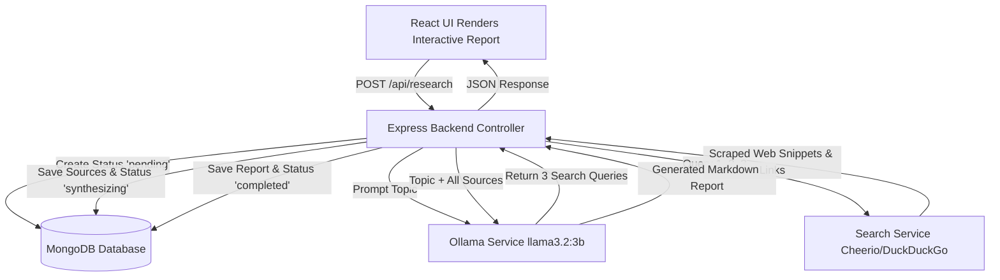

# 🔬 Research Log - Autonomous AI Agent

An end-to-end full-stack **Autonomous AI Research Agent** built with the **MERN stack** (MongoDB, Express, React, Node.js) and powered locally by **Ollama (`llama3.2:3b`)**. 

This system accepts user research topics, plans breakdown search queries, searches and scrapes web information via DuckDuckGo HTML parser, synthesizes the findings into structured, formatted Markdown reports, and maintains a complete history log stored in MongoDB.

---

## 📑 Table of Contents

- [Overview & Key Features](#-overview--key-features)
- [System Architecture & Workflow](#-system-architecture--workflow)
- [Tech Stack](#-tech-stack)
- [Prerequisites](#-prerequisites)
- [Step-by-Step Installation & Setup Guide](#-step-by-step-installation--setup-guide)
  - [Step 1: Clone the Repository](#step-1-clone-the-repository)
  - [Step 2: Setup Local LLM (Ollama)](#step-2-setup-local-llm-ollama)
  - [Step 3: Setup Backend Environment & Dependencies](#step-3-setup-backend-environment--dependencies)
  - [Step 4: Configure Backend Environment Variables](#step-4-configure-backend-environment-variables)
  - [Step 5: Setup Frontend Environment & Dependencies](#step-5-setup-frontend-environment--dependencies)
  - [Step 6: Running the Full-Stack Application](#step-6-running-the-full-stack-application)
- [Detailed Explanation of Project Workflow](#-detailed-explanation-of-project-workflow)
  - [Phase 1: User Query & Research Initialization](#phase-1-user-query--research-initialization)
  - [Phase 2: Autonomous Query Generation](#phase-2-autonomous-query-generation)
  - [Phase 3: Web Scraping & Data Extraction](#phase-3-web-scraping--data-extraction)
  - [Phase 4: Synthesis & Markdown Report Generation](#phase-4-synthesis--markdown-report-generation)
  - [Phase 5: Persistence & History Retrieval](#phase-5-persistence--history-retrieval)
- [Project Directory Structure](#-project-directory-structure)
- [API Reference](#-api-reference)
- [Conclusion](#-conclusion)

---

## 🌟 Overview & Key Features

- 🤖 **100% Local AI Intelligence**: Utilizes local LLM inference via Ollama (`llama3.2:3b`) ensuring data privacy, low cost, and zero external API dependencies for AI generation.
- 🔎 **Autonomous Multi-Angle Search Planning**: Automatically breaks down complex research prompts into 3 distinct, target-specific search queries.
- 🌐 **Web Scraping & Resilient Searching**: Scrapes real-time web results using Cheerio and DuckDuckGo HTML, with automatic simulated fallbacks if rate-limited.
- 📝 **Markdown Report Generation**: Synthesizes unstructured web search results into structured, professional Markdown reports with Executive Summaries, Key Findings, Strategic Recommendations, and Reference citations.
- 💾 **Historical Log Storage**: Stores all queries, sources, search status, timestamps, and generated markdown reports in MongoDB.
- 🎨 **Modern Dark-Themed UI**: React-based frontend styled with custom glassmorphism design, real-time loading feedback, sidebar navigation for past logs, tabbed report/source viewers, and one-click copy functionality.

---

## 🏗 System Architecture & Workflow



---

## 💻 Tech Stack

### **Frontend**
- **React.js** (Vite build tool)
- **Lucide React** (Modern iconography)
- **React Markdown** & **Remark GFM** (Markdown rendering with tables and code blocks)
- **Vanilla CSS3** (Glassmorphism design system with modern custom variables)

### **Backend**
- **Node.js** & **Express.js** (REST API framework)
- **MongoDB** & **Mongoose ORM** (Data persistence)
- **Axios** (HTTP requests for scraping and LLM API calls)
- **Cheerio** (HTML parsing and web scraping)
- **Nodemon** (Development hot-reloading)

### **Artificial Intelligence / LLM**
- **Ollama** running **Llama 3.2 (3B)** locally at `http://127.0.0.1:11434`

---

## 📋 Prerequisites

Before starting, ensure you have the following installed on your machine:
1. **Node.js** (v18.x or higher) & **npm** (v9.x or higher)
2. **MongoDB** (Local instance running on `mongodb://localhost:27017` or MongoDB Atlas URI)
3. **Ollama** installed on your system ([ollama.com](https://ollama.com))

---

## 🚀 Step-by-Step Installation & Setup Guide

### Step 1: Clone the Repository
```bash
git clone https://github.com/SparshRoy02/Research-Log.git
cd Research-Log
```

### Step 2: Setup Local LLM (Ollama)
1. Install Ollama from [ollama.com](https://ollama.com).
2. Open your command terminal and pull/verify the required Llama model:
   ```bash
   ollama pull llama3.2:3b
   ```
3. Test running the model in terminal:
   ```bash
   ollama run llama3.2:3b
   ```
*(Keep Ollama running in the background. It listens by default on port `11434`)*.

---

### Step 3: Setup Backend Environment & Dependencies

1. Navigate to the `backend` folder:
   ```bash
   cd backend
   ```
2. Install the backend node modules:
   ```bash
   npm install
   ```

---

### Step 4: Configure Backend Environment Variables

In the `backend` folder, create a `.env` file (or rename `.env.example` to `.env`):

```env
PORT=5000
MONGODB_URI=mongodb://127.0.0.1:27017/research_db
OLLAMA_HOST=http://127.0.0.1:11434
OLLAMA_MODEL=llama3.2:3b
```

---

### Step 5: Setup Frontend Environment & Dependencies

1. Open a new terminal window and navigate to the `frontend` folder:
   ```bash
   cd frontend
   ```
2. Install frontend dependencies:
   ```bash
   npm install
   ```

---

### Step 6: Running the Full-Stack Application

1. **Start the Backend Server**:
   In `backend` directory:
   ```bash
   npm run dev
   ```
   *(Backend starts on `http://localhost:5000`)*

2. **Start the Frontend Development Server**:
   In `frontend` directory:
   ```bash
   npm run dev
   ```
   *(Vite dev server starts on `http://localhost:5173`)*

3. Open your browser and navigate to `http://localhost:5173` to start using the Autonomous Research Agent.

---

## 🔍 Detailed Explanation of Project Workflow

### Phase 1: User Query & Research Initialization
1. The user inputs a research topic (e.g., *"Impact of Quantum Computing on Modern Cryptography"*) in the React frontend (`ResearchForm.jsx`).
2. A `POST /api/research` request is sent to the Express server.
3. Express creates a record in MongoDB with status `pending`.

### Phase 2: Autonomous Query Generation
1. The backend delegates the research topic to `ollamaService.js`.
2. A system prompt instructs Ollama (`llama3.2:3b`) to act as a research query planner and break the main topic into **3 distinct, effective web search queries**.
3. The generated search queries are saved into MongoDB, and the research status transitions to `searching`.

### Phase 3: Web Scraping & Data Extraction
1. `searchService.js` loops through each of the 3 generated queries.
2. It fetches search results by parsing DuckDuckGo HTML using **Cheerio**.
3. Extracted metadata includes:
   - Page Title
   - URL
   - Text Snippet
4. Built-in fallback mechanism: IfDuckDuckGo rate-limits requests, `searchService` generates fallback contextual simulation objects so the pipeline never crashes.
5. Deduplicated source results are attached to the research record, and status transitions to `synthesizing`.

### Phase 4: Synthesis & Markdown Report Generation
1. `ollamaService.js` compiles the scraped snippets into a structured prompt.
2. Ollama synthesizes the raw unstructured snippets into a professional, publication-ready **Markdown Report** featuring:
   - **Executive Summary**
   - **Key Themes & Detailed Findings**
   - **Technical Details / Statistics**
   - **Strategic Recommendations**
   - **Citations & References**
3. The generated report is saved to MongoDB with status `completed`.

### Phase 5: Persistence & History Retrieval
1. The frontend receives the finished research JSON payload and updates `ReportViewer.jsx`.
2. Users can browse past research sessions via the left sidebar (`ResearchHistory.jsx`), which queries `GET /api/research`.
3. Users can copy the Markdown report or inspect raw collected web sources.

---

## 📁 Project Directory Structure

```
Research-Log/
│
├── backend/
│   ├── src/
│   │   ├── config/
│   │   │   └── db.js                 # MongoDB connection logic
│   │   ├── controllers/
│   │   │   └── researchController.js # Pipeline orchestration logic
│   │   ├── models/
│   │   │   └── Research.js           # Mongoose schema for research logs
│   │   ├── routes/
│   │   │   └── researchRoutes.js     # API endpoints definitions
│   │   ├── services/
│   │   │   ├── ollamaService.js      # Local LLM integration & prompt engineering
│   │   │   └── searchService.js      # Web scraper (DuckDuckGo + Cheerio)
│   │   └── server.js                 # Express application entry point
│   ├── .env.example                  # Environment template
│   ├── package.json                  # Backend dependencies
│   └── test_research.js              # Standalone CLI test script
│
├── frontend/
│   ├── src/
│   │   ├── components/
│   │   │   ├── ReportViewer.jsx      # Markdown report & source viewer component
│   │   │   ├── ResearchForm.jsx      # Query input & status indicator component
│   │   │   └── ResearchHistory.jsx   # Sidebar list for past research records
│   │   ├── App.css                   # Glassmorphism design & utility styles
│   │   ├── App.jsx                   # Main React container state logic
│   │   └── main.jsx                  # React entry point
│   ├── index.html                    # Root HTML file
│   ├── vite.config.js                # Vite configuration with API proxying
│   └── package.json                  # Frontend dependencies
│
└── README.md                         # Project documentation
```

---

## 🌐 API Reference

| Method | Endpoint | Description | Payload / Query |
| :--- | :--- | :--- | :--- |
| `POST` | `/api/research` | Triggers autonomous research pipeline | `{ "topic": "Your research topic" }` |
| `GET` | `/api/research` | Fetches history list of all past research records | None |
| `GET` | `/api/research/:id` | Fetches details of a specific research record | `id` (MongoDB ObjectId) |
| `GET` | `/health` | Server health check endpoint | None |

---

## 🎯 Conclusion

The **Deep Research Log AI Agent** demonstrates how local open-source Large Language Models (LLMs) like **Llama 3.2** can be seamlessly integrated with web scrapers and full-stack MERN architectures to build **privacy-preserving, cost-effective, and fully autonomous research engines**. 

By eliminating reliance on paid proprietary LLM APIs and external search API keys, this project provides a customizable blueprint for localized knowledge retrieval, autonomous agent planning, and structured document synthesis.
